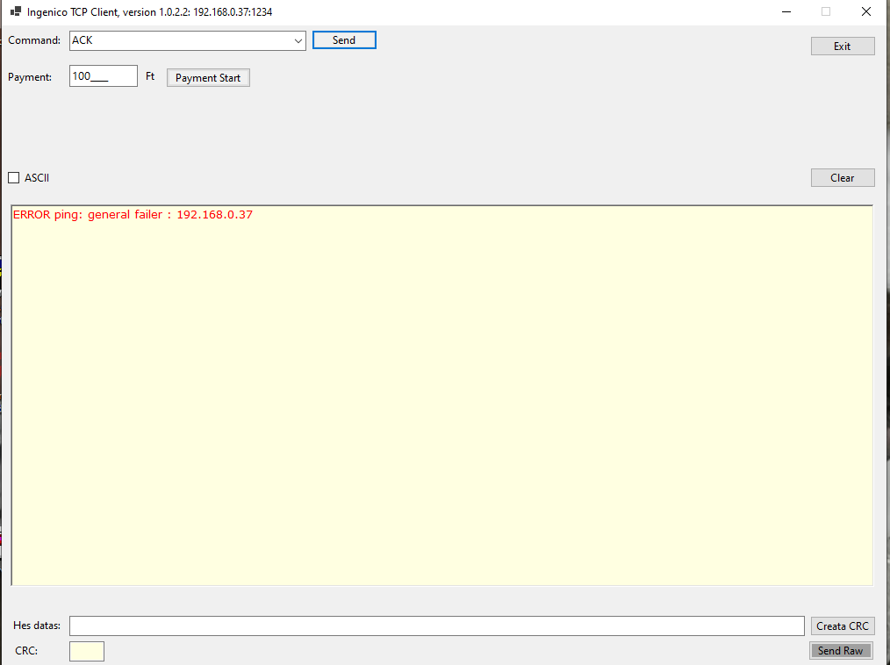
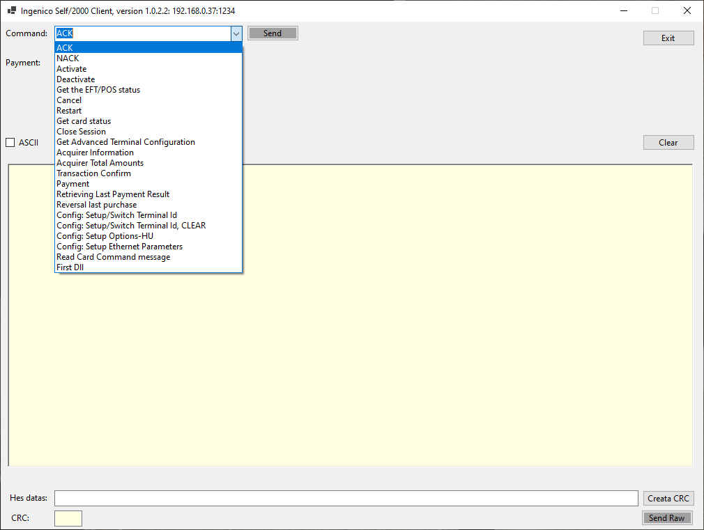

## 
Ingenico_TCP_Client

### 
SELF/2000 Compact Multiple Reader

 

## Dokumentations 
Ingenico Guide: "./doc/GUIDE_SELF_2000_4000_5000.pdf" 
External interface protocol for iSelf EFT/POS terminals : "./doc/InterfaceProtocol_iSelf-v3.27.pdf"

## Enviroment 
- Windows 10 64-bit 
- Microsoft Visual Studio Community 2022 
- 
### Enviroment VS2022: 
- target framework: .NET7.0 

### Images: 

 

 